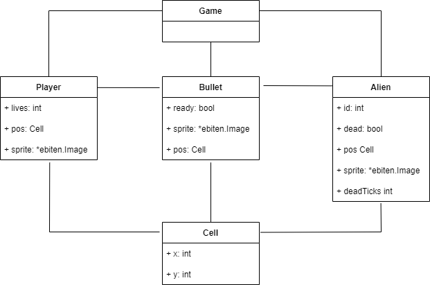

# Architecture

## Introduction

Space invaders is a game created by Toshihiro Nishikado and released in 1978. The objective of the game is to eliminate waves of aliens that move towards the player with the help of a laser gun. The more aliens are killed the greater the score. 

## Libraries / dependencies

- go get github.com/hajimehoshi/ebiten/v
- go get github.com/hajimehoshi/ebiten/v2/ebitenutil
- go get github.com/nfnt/resize

## Usage of the libraries

### Ebiten

> Ebiten is an open source game library for the Go programming language. Ebiten's simple API allows you to quickly and easily develop 2D games that can be deployed across multiple platforms.

We decided to use Ebiten to allow us to quickly display our game into a screen with better graphics than using characters in a terminal. Using this library prevented us from having to worry about more technical aspects unrelated to our game such as frame rate, drawing to the screen, etc.

### Ebiten Util

> Provides utility functions for Ebiten.

We used it to:
- Import images to our game layout from a file
- Draw text into our game layout
- Draw shapes into our game layout

### Resize

> Image resizing for the Go programming language with common interpolation methods.

Since our game is composed of squares (See [Game Design](#game-design)) of a certain size that each represents an entity, when we added our assets we had to scale them to fit said square.

So, instead of going to an external software like photoshop to adapt it, we decided to use this library that allows us to change the size of an image, and since we are using pixel art, it had an interpolation function (Nearest Neighbor) that kept the quality.

## Game design

### UML diagram


### Core functions

**func initGrid()**
```
Initializes the data structure that the game uses to function.
The game is based on a 2D Array (Board) where each element is an int containing the id of the entity in said position, the ids are the following:
-2 Player bullet
-1 Unusable space
0 Empty space
1 Player
2+ Aliens
The amount of rows and columns is determined by the size of the Window divided by the size of a Cell.
```

**func loadImages() error**
```
Utilizes *ebitenutil* to load our images from a file, if one can’t load the function will throw an *error* and the game won’t load, if everything works it’ll return *nil*.
Adds the icon of our game to the window.
Since our game assets are all in a spritesheet (single file), we get the spritesheet and then resize it to fill the size of our Cells using *Resize*.
Each sprite is assigned a subimage of said spritesheet.
```

**func initAliens(amount int)**
```
This function creates and populates a slice with the same length as the parameter passed with Aliens that will be used in other parts of the code such as the alienBrain(id int) or drawAliens(screen *ebiten.Image) functions.
```

**func alienBrain(id int)**
```
This function is what will become a goroutine for each alien.
It first gets the alien associated with the id parameter and then calls the functions of it’s actions in an infinite loop with a delay. This loop will end if the game is over or the alien got killed.
```

**func moveAlien(alien \*Alien)**
```
This function randomly generates a direction to move, if the target cell to move is not available, it will look for a new target.
After deciding a target, the function will wait for access to the grid by using a channel with buffer size of 1, when it has access to the grid it will attempt to execute the movement, if something took that place in the time frame from calculation to execution, the alien will cancel the movement operation.
```

**func alienShoot(alien \*Alien)**
```
Every time this function is called a “dice roll” is made and if the number suficies the condition the alien will generate a bullet as a goroutine, if it fails nothing else will happen.
```

**func generateAlienBullet(alien \*Alien)**
```
Generates an alien bullet in the cell below the alien.
```

**func drawAliens(screen \*ebiten.Image)**
```
Draws all the aliens in the aliens array into the game screen
```

**func initBullets()**
```
Creates a slice of Bullets (zero value) with length of 100
```

**func generatePlayerBullet()**
```
Puts a player Bullet in the bullets slice in the first usable place. A usable place is an array entry that contains a Bullet with the ready property equal to false. The newly created Bullet is assigned a ready value of true and the position of the player.
```

**func generateAlienBullet(alien \*Alien)**
```
Puts an alien Bullet in the bullet's slice in the first usable place. A usable place is an array entry that contains a Bullet with the ready property equal to false. The newly created Bullet is assigned a ready value of true and the position of the passed alien
```

**func moveBullet(bullet \*Bullet, direction int)**
```
Goroutine that moves a specific bullet in a certain direction (-1 = up, 1 = down). This goroutine is called right after creation and it will move the bullet until it hits something, once it stops the bullet gets destroyed by assigning ready value of false.
```

**func drawBullets(screen \*ebiten.Image)**
```
Draws all the Bullets in the bullets slice that have a ready value of true.
```

**func initPlayer()**
```
Initializes a player with ten lives at the very bottom of the window and horizontally aligned to the center. 
```

**func playerMove()**
```
Goroutine called in player initialization that moves the player according to a key input.
```

**func playerShoot()**
```
Goroutine called in player initialization that generates a player bullet whenever he/she presses space. 
```

**drawPlayer(screen \*ebiten.Image)**
```
Draws the player into the game screen.
```

**func drawText(screen \*ebiten.Image)**
```
Draws the score and lives of the player into the game screen.
```

